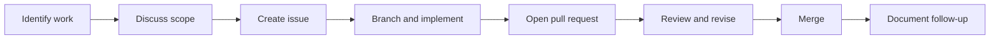

# Purpose

## Overview

The COSDS Engineering Handbook defines how contributors plan, build, review,
and maintain software for the Network Theory Applied Research Institute
(NTARI). COSDS stands for Community Orchestration Software Development Sprint:
a focused, volunteer-friendly engineering model for turning research-informed
ideas into reliable open-source systems.

This handbook is the shared operating manual for COSDS participants. It is
written for volunteers, maintainers, researchers, technical leads, reviewers,
and project coordinators who need a common set of expectations before they
contribute to NTARI repositories.

## Handbook Goals

The handbook exists to make NTARI engineering work:

- **Understandable**: contributors can learn the workflow without private
  context.
- **Reviewable**: every change has a clear purpose, owner, and audit trail.
- **Secure**: contributors avoid exposing private information, secrets, or
  unsafe implementation patterns.
- **Inclusive**: volunteers can participate without already knowing NTARI's
  internal practices.
- **Sustainable**: maintainers can operate repositories consistently over time.
- **Open-source aligned**: engineering choices respect AGPL-3.0 obligations and
  community governance.

## Audience

| Audience | Primary need | Relevant chapters |
| --- | --- | --- |
| New volunteers | Understand how to participate safely and productively | [Engineering Roles](03-engineering-roles.md), [GitHub Workflow](05-github-workflow.md) |
| Maintainers | Apply consistent review, release, and repository standards | [Pull Request Process](08-pull-request-process.md), [Repository Standards](10-repository-standards.md) |
| Reviewers | Evaluate correctness, maintainability, and risk | [Code Review Standards](09-code-review-standards.md) |
| Project coordinators | Keep communication and issue flow organized | [Communication Standards](04-communication-standards.md) |
| Technical leads | Align implementation decisions with NTARI principles | [Engineering Principles](02-engineering-principles.md) |

## Scope

This handbook covers engineering process and repository practice for COSDS
work. It applies to NTARI-managed software, documentation, automation, and
configuration repositories unless a repository-specific guide states a stricter
requirement.

This handbook does not replace:

- Project-specific architecture documentation.
- Security disclosure procedures in [`../../SECURITY.md`](../../SECURITY.md).
- The repository license in [`../../LICENSE`](../../LICENSE).
- The community standards in [`../../CODE_OF_CONDUCT.md`](../../CODE_OF_CONDUCT.md).

## Relationship to AGPL-3.0

NTARI repositories may use the GNU Affero General Public License v3.0
(AGPL-3.0). Contributors must treat licensing as an engineering constraint, not
an afterthought. In practice, this means:

- Do not copy incompatible code, documentation, diagrams, or configuration into
  NTARI repositories.
- Preserve license notices and attribution when required.
- Keep source availability obligations in mind for network-accessible systems.
- Ask maintainers before introducing third-party dependencies, generated code,
  or assets with unclear licensing.

## How to Use This Handbook

1. Start with [Engineering Principles](02-engineering-principles.md) to
   understand the values behind the process.
2. Review [Engineering Roles](03-engineering-roles.md) to identify your role in
   the sprint.
3. Follow [GitHub Workflow](05-github-workflow.md),
   [Branching Strategy](06-branching-strategy.md), and
   [Commit Message Standards](07-commit-message-standards.md) when preparing
   changes.
4. Use [Pull Request Process](08-pull-request-process.md) and
   [Code Review Standards](09-code-review-standards.md) during review.
5. Apply [Repository Standards](10-repository-standards.md) when creating or
   maintaining repository structure.

## COSDS Lifecycle

The lifecycle is intentionally simple. COSDS values small, reviewable changes
that can be understood by contributors who were not present for the original
conversation.

## Definition of Ready

Work is ready to begin when:

- The problem is written down in an issue, RFC, or maintainer-approved task.
- The expected outcome is clear enough to review.
- The proposed work has an owner.
- Dependencies and risks are identified.
- The work can be completed without private or undocumented knowledge.

## Definition of Done

Work is done when:

- The change is merged through the approved GitHub workflow.
- Required review has been completed.
- Tests, checks, or manual validation are documented.
- User-facing behavior or documentation has been updated where needed.
- Follow-up work is captured in issues rather than hidden in comments.

## Related Chapters

- [Engineering Principles](02-engineering-principles.md)
- [Communication Standards](04-communication-standards.md)
- [Pull Request Process](08-pull-request-process.md)
- [Repository Standards](10-repository-standards.md)
