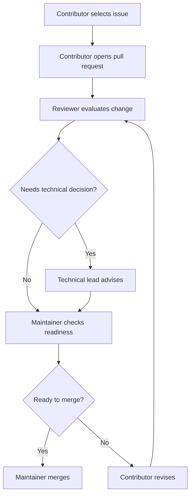

# Engineering Roles

## Overview

COSDS is designed for coordinated volunteer participation. Clear roles help
contributors understand decision rights, review expectations, and escalation
paths without requiring private organizational knowledge.

A person may hold more than one role. For example, a maintainer may also author
a pull request. When roles overlap, the contributor should be explicit about
which responsibility they are performing in the moment.

## Role Summary

| Role | Primary responsibility | Typical GitHub activity |
| --- | --- | --- |
| Volunteer contributor | Completes scoped tasks and proposes improvements. | Issues, branches, pull requests, review responses. |
| Reviewer | Evaluates changes for correctness, clarity, risk, and maintainability. | Pull request reviews and comments. |
| Maintainer | Owns repository health, merge decisions, labels, and workflow quality. | Triage, approvals, merges, releases. |
| Technical lead | Guides technical direction and resolves engineering tradeoffs. | RFC feedback, architecture review, escalation decisions. |
| Project coordinator | Keeps sprint work organized and contributor-friendly. | Issue grooming, status updates, milestone tracking. |
| Security contact | Advises on sensitive reports and security-relevant changes. | Private reports, security reviews, remediation coordination. |

## Volunteer Contributor

Volunteer contributors are the engine of COSDS. They may write code,
documentation, tests, configuration, examples, or review notes.

Responsibilities:

- Choose work from approved issues or maintainer guidance.
- Ask clarifying questions early.
- Keep changes focused and reviewable.
- Follow [GitHub Workflow](05-github-workflow.md) and
  [Commit Message Standards](07-commit-message-standards.md).
- Respond respectfully to review feedback.
- Avoid adding confidential information or incompatible third-party material.

A volunteer contributor is not expected to know everything. They are expected to
communicate clearly and keep work visible.

## Reviewer

Reviewers protect quality and help contributors improve their work. A reviewer
may be a maintainer, technical lead, or trusted contributor.

Responsibilities:

- Review the stated goal before reviewing implementation details.
- Identify blocking issues clearly.
- Distinguish required changes from suggestions.
- Check tests, documentation, accessibility, and security implications.
- Use respectful, specific feedback.

Reviewers should follow [Code Review Standards](09-code-review-standards.md).

## Maintainer

Maintainers are accountable for repository health. They manage labels,
triage, branch protection, review routing, merges, and cleanup.

Responsibilities:

- Keep repository structure understandable.
- Ensure pull requests receive appropriate review.
- Enforce AGPL-3.0 and repository governance expectations.
- Merge only changes that meet the repository definition of done.
- Close or redirect work that is out of scope.
- Escalate unresolved technical or conduct concerns.

Maintainers should avoid merging their own high-risk changes without independent
review.

## Technical Lead

Technical leads guide engineering direction. They help contributors make
architecture, implementation, and tradeoff decisions that fit NTARI goals.

Responsibilities:

- Clarify technical scope.
- Review significant design decisions.
- Resolve implementation tradeoffs when consensus is blocked.
- Identify when an Engineering RFC is needed.
- Coordinate with maintainers on risk and sequencing.

Technical leads should prefer documented decisions over private direction.

## Project Coordinator

Project coordinators keep COSDS work navigable for volunteers. They do not need
to make technical decisions, but they help ensure work has clear ownership and
status.

Responsibilities:

- Help convert discussion into issues.
- Keep labels, milestones, and priorities current.
- Identify blocked work.
- Encourage updates on long-running tasks.
- Direct new volunteers to suitable first contributions.

## Security Contact

Security contacts help evaluate sensitive reports and security-relevant changes.
They may coordinate privately when public disclosure would increase risk.

Responsibilities:

- Review reports under [`../../SECURITY.md`](../../SECURITY.md).
- Advise maintainers on disclosure timing and remediation.
- Keep sensitive information out of public issues and pull requests.
- Confirm that remediation steps are documented at the appropriate level.

## Role Interaction Flow

## Escalation Expectations

Escalate when:

- A review is blocked by unresolved technical disagreement.
- A change may create security, privacy, or license risk.
- A contributor is unsure who can approve a decision.
- A conduct concern affects collaboration.
- A pull request has stalled and needs maintainer attention.

Use [Engineering Escalation](18-engineering-escalation.md) when that chapter is
available. Until then, ask a maintainer for the correct path.

## Related Chapters

- [Purpose](01-purpose.md)
- [Communication Standards](04-communication-standards.md)
- [Pull Request Process](08-pull-request-process.md)
- [Code Review Standards](09-code-review-standards.md)
