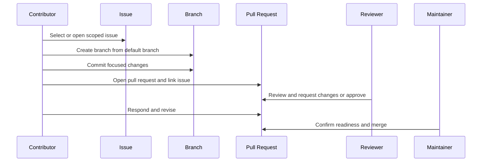

# GitHub Workflow

## Overview

COSDS uses GitHub as the system of record for planning, implementation, review,
and maintenance. Work should be traceable from issue to branch to pull request
to merge.

This workflow is designed for volunteers. It favors explicit context, small
changes, and asynchronous review.

## Standard Workflow



## Step 1: Find or Create an Issue

Before implementing non-trivial work, confirm that the work is visible in an
issue, RFC, or maintainer-approved task.

An issue should include:

- Problem statement.
- Expected outcome.
- Relevant files or components.
- Acceptance criteria when known.
- Risk or dependency notes.

Small typo fixes may go directly to a pull request if the purpose is obvious.

## Step 2: Create a Branch

Create a branch from the repository default branch.

```bash
git checkout main
git pull --ff-only
git checkout -b docs/update-review-guidance
```

Branch names should follow [Branching Strategy](06-branching-strategy.md).

## Step 3: Make Focused Changes

Keep the change aligned with the issue. If you discover related work, do not
silently expand the scope. Instead:

1. Note the discovery in the issue or pull request.
2. Ask whether it should be included.
3. Create a follow-up issue if it is separate.

## Step 4: Commit Clearly

Use concise, descriptive commits. Each commit should represent a coherent unit
of work.

Good examples:

```text
docs: add contributor onboarding checklist
test: cover invalid token handling
fix: prevent empty issue title submission
```

See [Commit Message Standards](07-commit-message-standards.md).

## Step 5: Open a Pull Request

Open a pull request when the change is ready for review or when early feedback
would reduce risk. Draft pull requests are encouraged for work in progress.

A pull request should include:

- Summary of the change.
- Link to the related issue or RFC.
- Validation performed.
- Risks, limitations, or follow-up work.

See [Pull Request Process](08-pull-request-process.md).

## Step 6: Participate in Review

Review is collaborative. Contributors should respond to comments, ask for
clarification when needed, and push updates to the same branch.

When responding to review:

- Acknowledge the feedback.
- Explain the change made or the reason for a different approach.
- Mark conversations resolved only after the concern is addressed.
- Avoid force-pushing after review unless needed to clean history before merge.

## Step 7: Merge and Follow Up

A maintainer merges the pull request after required review and checks pass.
After merge:

- Confirm linked issues are closed or updated.
- Create follow-up issues for deferred work.
- Remove local branches when no longer needed.

```bash
git checkout main
git pull --ff-only
git branch -d docs/update-review-guidance
```

## Workflow States

| State | Meaning | Expected action |
| --- | --- | --- |
| Open issue | Work is proposed or available. | Clarify scope and assign owner. |
| In progress | A contributor is actively working. | Provide support and avoid duplicate work. |
| Draft PR | Work is visible but not ready for final review. | Give early feedback if requested. |
| Ready for review | Author believes the change is complete. | Review for quality and risk. |
| Changes requested | Reviewer found blocking concerns. | Author revises or discusses. |
| Approved | Required reviewers accept the change. | Maintainer verifies checks and merges. |
| Merged | Change is accepted into the default branch. | Close or update related issues. |

## Internal Link Expectations

When adding Markdown links:

- Prefer relative links for repository files.
- Link to related handbook chapters when context helps.
- Verify links before requesting review.
- Avoid linking to private resources from public documentation.

## Related Chapters

- [Branching Strategy](06-branching-strategy.md)
- [Commit Message Standards](07-commit-message-standards.md)
- [Pull Request Process](08-pull-request-process.md)
- [Code Review Standards](09-code-review-standards.md)
