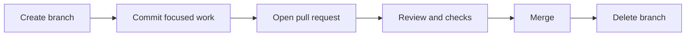

# Branching Strategy

## Overview

COSDS uses a simple branch-based workflow. Contributors create short-lived
branches from the default branch, open pull requests, and merge only after
review and required checks.

The strategy favors clarity over complexity. Long-running branches and hidden
integration work make volunteer collaboration harder and should be avoided.

## Default Branch

The default branch is the stable integration branch for accepted work. In most
NTARI repositories this branch is expected to be `main`.

Rules for the default branch:

- Do not commit directly unless repository maintainers explicitly allow it for
  emergency maintenance.
- Keep it releasable or publishable.
- Protect it with review and status checks when repository settings permit.
- Treat it as the source of truth for contributors.

## Branch Naming

Use branch names that explain the work without requiring private context.

Recommended format:

```text
<type>/<short-description>
```

Common branch types:

| Type | Use for | Example |
| --- | --- | --- |
| `docs` | Documentation-only changes | `docs/add-review-guidance` |
| `fix` | Bug fixes | `fix/handle-empty-config` |
| `feat` | New user-facing behavior | `feat/add-rfc-template` |
| `chore` | Maintenance and configuration | `chore/update-spellcheck` |
| `refactor` | Internal restructuring | `refactor/split-parser-module` |
| `test` | Test-only updates | `test/add-link-check-cases` |
| `security` | Security-sensitive remediation | `security/harden-token-handling` |

## Branch Scope

A branch should have one purpose. If a branch starts to contain unrelated work,
split it before review.

Good branch scope:

- Add one handbook chapter.
- Fix one broken link category.
- Update one workflow configuration.
- Implement one issue with tests.

Poor branch scope:

- Rewrite documentation, change CI, and refactor code together.
- Mix formatting-only changes with behavior changes.
- Add a dependency while also changing unrelated files.

## Keeping a Branch Current

Before opening a pull request, update your local default branch and rebase or
merge as appropriate for the repository.

```bash
git checkout main
git pull --ff-only
git checkout docs/add-review-guidance
git rebase main
```

If rebasing would be confusing for shared branches, ask a maintainer before
rewriting history.

## Force Push Guidance

Force pushing can erase review context when used carelessly.

Allowed:

- Updating your own branch before review begins.
- Cleaning commit history when maintainers request it.
- Resolving rebase conflicts on a branch you own.

Avoid:

- Force pushing after reviewers have commented unless necessary.
- Force pushing to branches used by multiple contributors without coordination.
- Rewriting default branch history.

When force pushing is necessary, use:

```bash
git push --force-with-lease
```

`--force-with-lease` is safer than `--force` because it refuses to overwrite
remote work that you have not seen locally.

## Branch Protection Expectations

Maintainers should configure branch protection when the repository is ready.
Recommended protections include:

- Require pull request review before merge.
- Require status checks for linting, tests, and link checks.
- Require branches to be up to date before merge when appropriate.
- Restrict direct pushes to the default branch.
- Include administrators unless an operational exception is documented.

## Branch Lifecycle



Delete merged branches to keep repository navigation clean. Branches with
abandoned work should be closed or archived through an issue comment explaining
why the work stopped.

## Related Chapters

- [GitHub Workflow](05-github-workflow.md)
- [Commit Message Standards](07-commit-message-standards.md)
- [Pull Request Process](08-pull-request-process.md)
- [Repository Standards](10-repository-standards.md)
