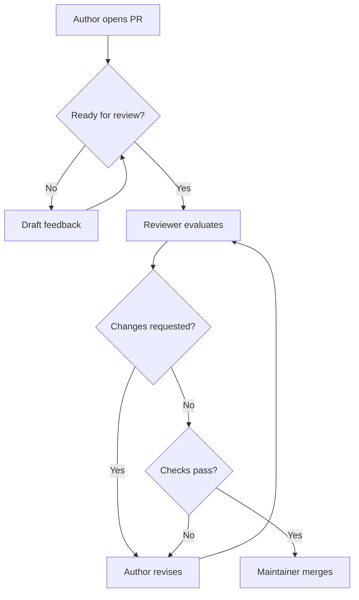

# Pull Request Process

## Overview

Pull requests are the primary review mechanism for COSDS work. A pull request
should explain what changed, why it changed, how it was validated, and what
risks remain.

A pull request is not only a code container. It is a decision record and a
collaboration space.

## When to Open a Pull Request

Open a pull request when:

- The change is ready for review.
- Early feedback would prevent wasted effort.
- A maintainer asks to see the direction before the work is complete.
- A draft is useful for coordination.

Use a draft pull request when the work is not ready for final approval.

## Pull Request Requirements

Every non-trivial pull request should include:

| Requirement | Purpose |
| --- | --- |
| Summary | Helps reviewers understand the change quickly. |
| Related issue or RFC | Preserves planning context. |
| Validation | Shows how the author checked the change. |
| Risk notes | Identifies security, migration, or compatibility concerns. |
| Screenshots or examples | Helps review user-facing changes when applicable. |
| Follow-up work | Prevents hidden TODOs from being lost. |

## Pull Request Size

Keep pull requests small enough for meaningful review.

A pull request is probably too large if it:

- Changes many unrelated areas.
- Mixes formatting, refactoring, and behavior changes.
- Requires reviewers to understand multiple independent decisions.
- Cannot be validated with a clear checklist.

When a large change is unavoidable, explain the reason and provide a review
strategy. For example:

```markdown
Review strategy:

1. Review `schema.ts` for the data model change.
2. Review `migration.sql` for compatibility.
3. Review tests last; they describe expected behavior.
```

## Draft Pull Requests

Draft pull requests are encouraged when collaboration is useful before final
review.

Use a draft pull request to:

- Share early design direction.
- Run CI against work in progress.
- Ask a focused question.
- Coordinate multiple contributors.

Do not request final approval on a draft pull request. Mark it ready for review
when the author believes it meets the definition of done.

## Review Checklist for Authors

Before requesting review, authors should confirm:

- The pull request has a clear title.
- The description explains the change and motivation.
- Related issues or RFCs are linked.
- Internal Markdown links are valid when documentation is changed.
- Tests, lint checks, or manual validation are documented.
- Security and license concerns have been considered.
- The change does not include secrets or private information.

## Validation Examples

Documentation-only change:

```markdown
Validation:

- Reviewed rendered Markdown locally.
- Verified relative links to related handbook chapters.
- Confirmed no placeholder text remains in edited pages.
```

Code change:

```markdown
Validation:

- `npm test`
- `npm run lint`
- Manually verified error handling for empty project names.
```

Workflow change:

```markdown
Validation:

- Validated workflow YAML syntax.
- Confirmed paths trigger only for Markdown and workflow changes.
- Reviewed permissions for least privilege.
```

## Pull Request Review Flow



## Merge Expectations

A maintainer should merge only when:

- Required reviews are complete.
- Required checks pass or an exception is documented.
- The change matches the pull request description.
- Follow-up work is captured.
- The merge method matches repository policy.

## Closing Pull Requests

Closing a pull request is appropriate when:

- The work is no longer in scope.
- The author withdraws the proposal.
- A different approach is accepted.
- The pull request is abandoned and cannot be completed safely.

When closing, leave a brief explanation and link to follow-up work when useful.

## Related Chapters

- [GitHub Workflow](05-github-workflow.md)
- [Branching Strategy](06-branching-strategy.md)
- [Commit Message Standards](07-commit-message-standards.md)
- [Code Review Standards](09-code-review-standards.md)
- [Repository Standards](10-repository-standards.md)
