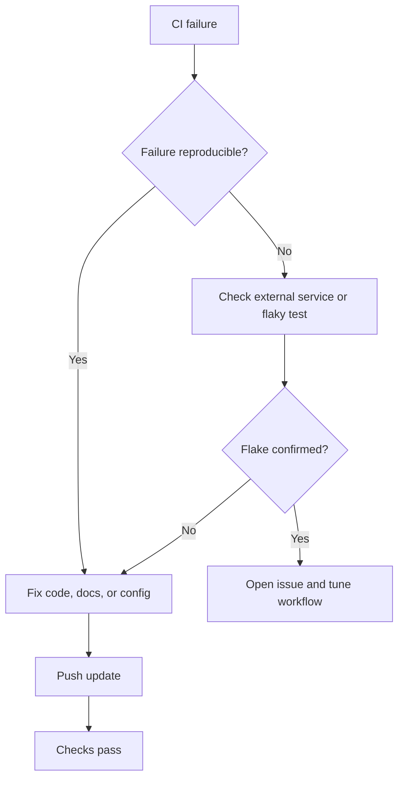

# CI/CD Standards

## Overview

Continuous integration and continuous delivery help NTARI repositories stay
reviewable, reproducible, and safe. In COSDS, automation should support
contributors without hiding important decisions from maintainers.

CI/CD standards apply to GitHub Actions workflows, status checks, build scripts,
test commands, release automation, and deployment gates.

## Goals

CI/CD should:

- Catch errors before merge.
- Provide fast feedback to contributors.
- Use least-privilege permissions.
- Make failures actionable.
- Avoid leaking secrets or private data.
- Support AGPL-3.0 source availability and reproducible release practices.

## Workflow Design Principles

| Principle | Practice |
| --- | --- |
| Keep checks relevant | Run workflows only for paths that can affect them. |
| Fail clearly | Error output should tell contributors what to fix. |
| Minimize permissions | Use read-only permissions unless write access is required. |
| Prefer reproducibility | Pin runtime versions and document build commands. |
| Separate concerns | Keep lint, test, security, and release workflows distinct. |
| Avoid surprise deployment | Deploy only from protected branches or approved release workflows. |

## Recommended Workflow Categories

| Workflow | Purpose | Example trigger |
| --- | --- | --- |
| Markdown lint | Enforce documentation style | Pull requests changing `*.md` |
| Link check | Detect broken documentation links | Pull requests and scheduled runs |
| Spellcheck | Catch spelling and terminology errors | Pull requests changing docs |
| Unit tests | Validate code behavior | Pull requests changing source files |
| Security scan | Detect dependency or configuration risk | Pull requests and scheduled runs |
| Release | Build and publish artifacts | Tags or maintainer-approved dispatch |

## GitHub Actions Standards

GitHub Actions workflows should:

- Declare explicit `permissions`.
- Use descriptive workflow and job names.
- Use maintained actions from trusted sources.
- Avoid secrets in pull request workflows from forks unless explicitly safe.
- Use path filters when appropriate.
- Keep deployment separate from validation.

Example read-only workflow header:

```yaml
name: Markdown Lint

on:
  pull_request:
    paths:
      - "**/*.md"

permissions:
  contents: read
```

## Secrets and Sensitive Data

CI must never print secrets, tokens, private keys, or sensitive repository
configuration.

Checklist:

- Store secrets only in approved GitHub secret stores or external secret
  management systems.
- Do not echo secrets in logs.
- Do not run untrusted pull request code with privileged credentials.
- Redact sensitive values from debug output.
- Rotate credentials if accidental exposure is suspected.

Report concerns through [`../../SECURITY.md`](../../SECURITY.md).

## Status Checks

Maintainers should require checks that match repository risk.

For documentation repositories:

- Markdown lint.
- Broken link check.
- Spellcheck.

For software repositories:

- Formatting or linting.
- Unit tests.
- Integration tests when practical.
- Dependency or vulnerability scanning.
- Build verification.

Required checks should be stable. If a check is flaky, fix or tune it before
making it a hard merge requirement.

## CI Failure Triage



When CI fails, contributors should include the failing check name and relevant
log excerpt in the pull request discussion if help is needed.

## Release and Deployment Controls

Release and deployment automation should be conservative.

Minimum expectations:

- Deploy only from protected branches, signed tags, or maintainer-approved
  manual workflows.
- Document release commands and rollback steps.
- Separate validation from production deployment.
- Require maintainer review for workflow changes that affect credentials or
  publishing.

See [Release Management](19-release-management.md) when that chapter is
available.

## Review Checklist

Before merging CI/CD changes, confirm:

- Workflow YAML is valid.
- Permissions are least-privilege.
- Triggers are appropriate.
- Secrets are not exposed to untrusted code.
- Failure messages are actionable.
- The workflow does not introduce Docusaurus or other tooling unless approved.
- Documentation explains new commands or checks.

## Related Chapters

- [GitHub Workflow](05-github-workflow.md)
- [Pull Request Process](08-pull-request-process.md)
- [Code Review Standards](09-code-review-standards.md)
- [Repository Standards](10-repository-standards.md)
- [Security Standards](13-security-standards.md)
