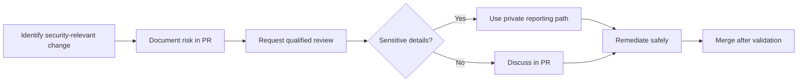

# Security Standards

## Overview

Security is a shared engineering responsibility in COSDS. Every contributor must
help protect users, maintainers, infrastructure, documentation integrity, and
open-source trust.

This chapter defines baseline security expectations for NTARI engineering work.
Sensitive reports must follow the repository security policy in
[`../../SECURITY.md`](../../SECURITY.md).

## Security Principles

| Principle | Meaning |
| --- | --- |
| Least privilege | Grant only the access required for the task. |
| Secure by default | Avoid unsafe defaults that require users to opt into safety. |
| Defense in depth | Use multiple controls rather than relying on one mechanism. |
| Public does not mean careless | Open-source work still requires careful handling of sensitive data. |
| Review high-risk changes | Security-relevant changes need explicit review. |
| Prefer traceability | Security decisions should be documented at the appropriate sensitivity level. |

## Sensitive Information

Never commit:

- Passwords, tokens, API keys, or private keys.
- `.env` files containing real credentials.
- Private infrastructure details that are not approved for publication.
- Personal data that is not required and authorized.
- Vulnerability details that have not been cleared for public disclosure.

If sensitive information is committed:

1. Stop sharing the branch or pull request link beyond necessary responders.
2. Notify maintainers using the security reporting path.
3. Rotate the exposed secret or credential.
4. Remove the secret from the repository history if maintainers determine that
   history rewriting is required.
5. Document the remediation at the appropriate level.

## Dependency Security

Before adding a dependency, ask:

- Is the dependency necessary?
- Is it maintained?
- Is its license compatible with the repository license?
- Does it introduce known vulnerabilities?
- Does it run code during installation or build?
- Is there a smaller or standard-library alternative?

Dependency changes should be visible in pull requests and reviewed for license,
security, and maintenance impact.

## Authentication and Authorization

Changes involving identity, access, or permissions require careful review.

Checklist:

- Authentication failures do not reveal sensitive information.
- Authorization checks happen server-side or in trusted control paths.
- Privilege boundaries are explicit.
- Default roles are least-privilege.
- Administrative actions are auditable.
- Tests cover allowed and denied access paths.

## Logging and Error Handling

Logs and errors should help operators without exposing sensitive information.

Safe logs may include:

- Request identifiers.
- Non-sensitive status codes.
- High-level operation names.
- Sanitized validation failures.

Unsafe logs include:

- Tokens or credentials.
- Full personal records.
- Private keys.
- Raw authorization headers.
- Sensitive infrastructure endpoints.

## Secure Review Flow

## Open-Source and AGPL-3.0 Considerations

AGPL-3.0 governance affects security and architecture decisions. Contributors
must avoid introducing components with incompatible licenses or unclear source
availability requirements.

When building network-accessible systems, maintainers should ensure that source
code availability obligations are understood before release or deployment.

## Security Review Checklist

Before merging a security-relevant change, confirm:

- No secrets or private data are included.
- Access control changes are tested.
- Error messages and logs are sanitized.
- Dependencies are necessary and reviewed.
- Configuration defaults are safe.
- Documentation does not expose sensitive procedures.
- A rollback or remediation plan exists for high-risk changes.

## Incident-Aware Documentation

Public documentation should explain safe behavior without publishing exploit
instructions or sensitive operational details. When a vulnerability is under
active remediation, coordinate with maintainers before adding public detail.

## Related Chapters

- [Engineering Principles](02-engineering-principles.md)
- [Communication Standards](04-communication-standards.md)
- [CI/CD Standards](12-ci-cd-standards.md)
- [Code Review Standards](09-code-review-standards.md)
- [Repository Standards](10-repository-standards.md)
