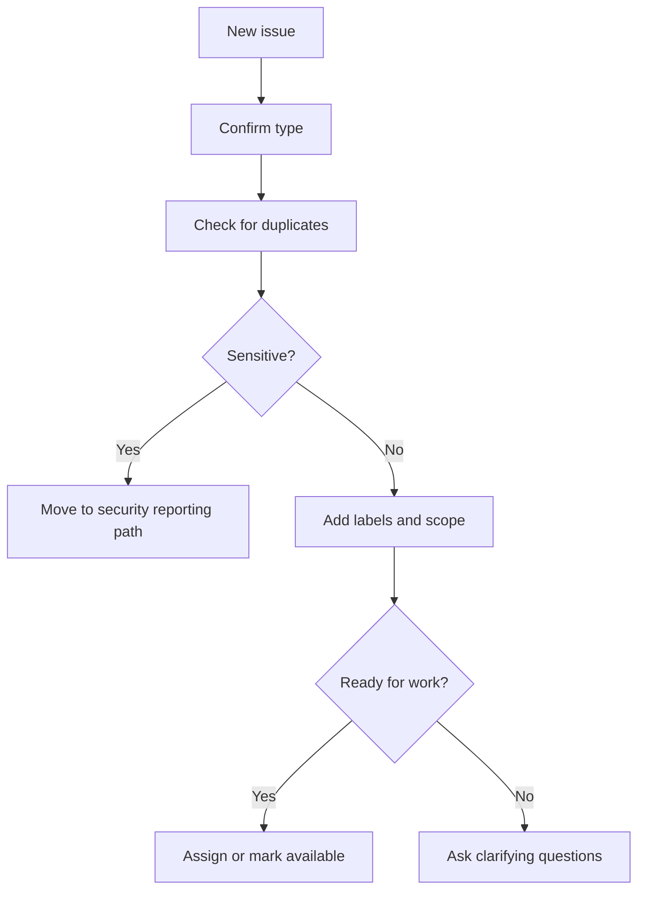

# Issue Management

## Overview

Issues are the planning and coordination backbone of COSDS. A good issue makes
work understandable, assignable, reviewable, and traceable. Issues should help
volunteers find work and help maintainers keep repository priorities visible.

## Issue Types

| Type | Use for | Template |
| --- | --- | --- |
| Bug | Something is broken or incorrect. | Bug Report |
| Feature | A new capability or enhancement. | Feature Request |
| Documentation | A documentation correction or gap. | Documentation Improvement |
| RFC | A significant engineering or governance proposal. | Engineering RFC |
| Maintenance | Repository cleanup or routine upkeep. | Maintainer-created issue |
| Security | Sensitive or risk-related concern. | Private reporting path when needed |

Sensitive issues should follow [`../../SECURITY.md`](../../SECURITY.md), not a
public issue.

## Good Issue Structure

A useful issue includes:

- A concise title.
- Problem statement.
- Context and links.
- Expected outcome.
- Acceptance criteria when known.
- Risk or dependency notes.
- Suggested owner or role when applicable.

Example:

```markdown
Title: Docs: clarify pull request validation examples

Problem:
New contributors are unsure what validation to include for documentation-only
pull requests.

Expected outcome:
Update the pull request process chapter with examples for documentation,
workflow, and code changes.

Acceptance criteria:
- Examples are copyable.
- Internal links are valid.
- No placeholder text remains.
```

## Labels

Labels help contributors filter and maintainers triage.

Recommended labels:

| Label | Meaning |
| --- | --- |
| `bug` | Incorrect behavior or broken repository function. |
| `documentation` | Documentation work or correction. |
| `enhancement` | New capability or improvement. |
| `rfc` | Proposal requiring broader review. |
| `good first issue` | Suitable for a new contributor. |
| `help wanted` | Maintainers welcome outside contribution. |
| `blocked` | Cannot proceed without a decision or dependency. |
| `security` | Security-relevant issue; use carefully and avoid sensitive details. |
| `maintenance` | Cleanup, configuration, or routine upkeep. |

## Triage Process



## Acceptance Criteria

Acceptance criteria define what must be true for the issue to be complete.
They should be specific enough for a reviewer to verify.

Good acceptance criteria:

- The broken link is replaced with a valid relative link.
- The pull request template asks authors to describe validation.
- The workflow runs only on Markdown changes.

Poor acceptance criteria:

- Make it better.
- Clean this up.
- Improve docs.

## Assignment and Ownership

Assignments should reflect active ownership. Do not assign contributors without
confirmation unless repository maintainers have an established process for doing
so.

If a contributor becomes unavailable, a maintainer may unassign the issue after
leaving a clear status comment.

## Stale Issues

Issues may become stale when they no longer reflect current priorities or lack
required information.

Before closing as stale:

- Ask whether the issue is still relevant.
- Identify missing information.
- Link replacement issues when applicable.
- Leave a clear closing reason.

## Linking Issues and Pull Requests

Pull requests should link related issues using GitHub keywords when appropriate:

```markdown
Closes #42
Refs #43
```

Use `Closes` when merging the pull request completes the issue. Use `Refs` when
the pull request is related but does not fully resolve the issue.

## Issue Management Checklist

Maintainers should periodically confirm:

- New issues are triaged.
- Labels are consistent.
- Duplicate issues are linked.
- Blocked issues identify the blocker.
- Security-sensitive issues are not discussed publicly.
- Good first issues are genuinely suitable for new contributors.
- Completed work is closed or linked to merged pull requests.

## Related Chapters

- [Communication Standards](04-communication-standards.md)
- [GitHub Workflow](05-github-workflow.md)
- [Pull Request Process](08-pull-request-process.md)
- [Volunteer Expectations](16-volunteer-expectations.md)
- [Engineering RFC](26-github-governance.md)
