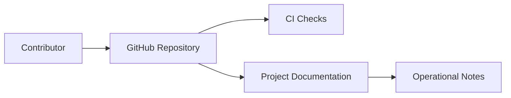

# Project Documentation

## Overview

Project documentation explains what a specific NTARI project is, how it works,
how contributors participate, and how maintainers operate it. It should give a
new volunteer enough context to make a safe first contribution without relying
on private knowledge.

This chapter defines baseline expectations for project-level documentation in
COSDS.

## Project Documentation Goals

Project documentation should answer:

- What problem does the project solve?
- Who uses or maintains it?
- What is the current maturity level?
- How do contributors set up and validate changes?
- Where are architecture, operations, and security notes?
- What license and governance expectations apply?

## Recommended Project README Structure

```markdown
# Project Name

## Overview

## Status

## Getting Started

## Development

## Testing

## Documentation

## Security

## Contributing

## License
```

The README should be concise. Detailed procedures should live in dedicated files
when they grow beyond a short section.

## Required Project Information

| Section | Purpose |
| --- | --- |
| Overview | Describes the project and audience. |
| Status | Explains maturity, stability, and known limitations. |
| Getting Started | Helps a contributor run or inspect the project. |
| Development | Documents local setup and common commands. |
| Testing | Lists validation commands and expectations. |
| Security | Links to reporting policy and project-specific notes. |
| Contributing | Links to repository contribution guidance. |
| License | States the applicable license and links to `LICENSE`. |

## Setup Instructions

Setup instructions should be reproducible.

Include:

- Required tools and versions.
- Installation commands.
- Environment variables with safe example values.
- How to run tests or checks.
- Common troubleshooting notes.

Do not include real credentials or private endpoints.

Good example:

````markdown
Copy the example environment file and replace placeholder values with local test
credentials:

```bash
cp .env.example .env
```
````

## Architecture Notes

Project documentation should identify major components and boundaries. Use a
Mermaid diagram when it improves understanding.



The diagram should be accompanied by text so the information remains accessible
outside Mermaid renderers.

## Operational Notes

Operational documentation should be separated from basic project introduction.
When operational details are sensitive, document the existence of the process
without exposing private information.

Include public-safe details such as:

- Service ownership.
- Support expectations.
- Public status information.
- Non-sensitive runbook links.

Avoid:

- Secrets.
- Private infrastructure topology.
- Exploit details.
- Emergency contacts that are not approved for public release.

## Documentation Ownership

Every project should identify who can review documentation changes. Ownership
may be expressed through CODEOWNERS, maintainers, or project-specific notes.

Questions to answer:

- Who reviews project documentation?
- Who reviews security-sensitive updates?
- Who approves architecture changes?
- Who updates documentation after releases?

## Documentation Checklist

Before considering project documentation ready, confirm:

- The README explains the project clearly.
- Setup instructions work for a new contributor.
- Validation commands are documented.
- Internal links resolve.
- Public documentation does not expose sensitive information.
- License references are accurate.
- Contribution paths are clear.
- Accessibility expectations are met.

## Relationship to Handbook Chapters

Project documentation should link back to shared handbook guidance instead of
repeating it. For example:

- Link to [GitHub Workflow](05-github-workflow.md) for contribution flow.
- Link to [Code Review Standards](09-code-review-standards.md) for review
  expectations.
- Link to [Security Standards](13-security-standards.md) for security baseline.
- Link to [Repository Standards](10-repository-standards.md) for repository
  structure.

## Future Docusaurus Compatibility

If project documentation may later be published through Docusaurus:

- Use stable filenames.
- Prefer relative links.
- Keep one top-level heading per page.
- Avoid repository-host-specific assumptions when a portable alternative exists.
- Delay front matter until the publishing structure is approved.

## Related Chapters

- [Documentation Standards](11-documentation-standards.md)
- [Repository Standards](10-repository-standards.md)
- [Security Standards](13-security-standards.md)
- [Volunteer Expectations](16-volunteer-expectations.md)
