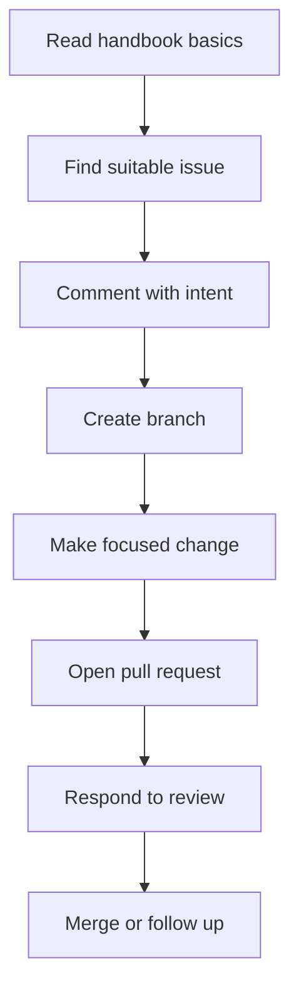

# Volunteer Expectations

## Overview

COSDS is designed to welcome volunteer contributors while protecting project
quality, contributor time, and NTARI governance obligations. Volunteers are not
expected to know every system or process before participating. They are expected
to communicate clearly, work in public where appropriate, and follow repository
standards.

This chapter explains how volunteers can participate effectively and safely.

## What Volunteers Can Expect

Volunteers should expect:

- Public issues that describe available work.
- Respectful communication from maintainers and reviewers.
- Review feedback focused on the work.
- Clear contribution and security reporting paths.
- Opportunities to ask questions before taking on work.
- Recognition that availability may vary.

Volunteers should not be expected to use private knowledge, personal accounts,
or unapproved credentials to complete public repository work.

## What NTARI Expects from Volunteers

| Expectation | Why it matters |
| --- | --- |
| Follow the Code of Conduct | Keeps collaboration safe and respectful. |
| Keep work scoped | Makes review possible for maintainers. |
| Communicate status | Helps coordinators avoid duplicate or stalled work. |
| Protect sensitive information | Preserves trust and security. |
| Respect licensing | Keeps AGPL-3.0 and third-party obligations intact. |
| Accept review professionally | Improves quality and shared understanding. |
| Ask questions early | Prevents wasted effort and hidden assumptions. |

## Getting Started

Recommended first steps:

1. Read [Purpose](01-purpose.md) and
   [Engineering Principles](02-engineering-principles.md).
2. Review [Communication Standards](04-communication-standards.md).
3. Find an issue labeled `good first issue` or `help wanted`.
4. Comment on the issue before starting substantial work.
5. Create a branch following [Branching Strategy](06-branching-strategy.md).
6. Open a pull request following [Pull Request Process](08-pull-request-process.md).

## Choosing Work

Good first contributions include:

- Fixing broken links.
- Improving unclear wording.
- Adding tests for an already-defined behavior.
- Updating examples that are out of date.
- Addressing small, well-scoped bugs.

Avoid starting with:

- Broad rewrites.
- Security-sensitive changes without maintainer guidance.
- Major architecture changes without an RFC.
- Work that depends on private systems or credentials.

## Communication Expectations

Volunteers should communicate in the issue or pull request associated with the
work.

Useful status comment:

```markdown
I can work on this. My plan is to update the documentation example and verify
all internal links. I expect to open a pull request this weekend.
```

Useful blocked comment:

```markdown
I am blocked because the expected behavior is unclear for archived projects.
Can a maintainer confirm whether archived projects should be included?
```

## Time and Availability

Volunteer availability varies. Contributors should avoid taking on work they
cannot reasonably progress.

If you need to pause work:

- Leave a status comment.
- Explain what remains.
- Unassign yourself if the work should be available to others.
- Link any branch or draft pull request that contains useful progress.

Maintainers may reassign stale work to keep the sprint moving.

## Quality Expectations

Before requesting review, volunteers should confirm:

- The change addresses the issue or stated goal.
- The pull request is focused.
- Markdown renders correctly when documentation is changed.
- Tests or validation steps are documented.
- No secrets, private data, or unapproved third-party content are included.
- Internal links are valid.

See [Code Review Standards](09-code-review-standards.md) for review criteria.

## Review Participation

Review feedback is part of collaboration. Volunteers should:

- Ask clarifying questions when feedback is unclear.
- Respond to requested changes with updates or rationale.
- Avoid resolving conversations before the concern is addressed.
- Treat maintainers and reviewers as partners.

Reviewers should also follow the same professional expectations. See
[Professional Conduct](17-professional-conduct.md).

## Licensing and Attribution

Because NTARI repositories may use AGPL-3.0, volunteers must be careful when
adding third-party material.

Do not add:

- Code copied from incompatible licenses.
- Images, diagrams, or text without permission or attribution.
- Generated content that cannot be reviewed or licensed appropriately.
- Dependency changes without a clear reason.

When unsure, ask maintainers before opening the pull request.

## Volunteer Contribution Flow



## Volunteer Checklist

Before contributing:

- Read the repository README.
- Review contribution and conduct expectations.
- Confirm the issue is still available.
- Ask questions if scope is unclear.

Before requesting review:

- Link the related issue.
- Summarize the change.
- Document validation.
- Check for secrets or private information.
- Verify relevant internal links.

## Related Chapters

- [Purpose](01-purpose.md)
- [Engineering Roles](03-engineering-roles.md)
- [Communication Standards](04-communication-standards.md)
- [GitHub Workflow](05-github-workflow.md)
- [Professional Conduct](17-professional-conduct.md)
