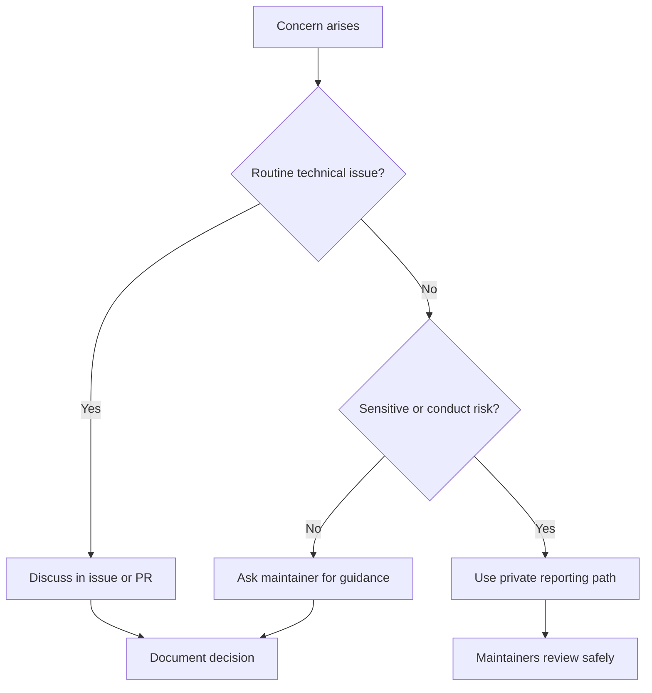

# Professional Conduct

## Overview

Professional conduct is essential to COSDS. NTARI contributors collaborate
across backgrounds, time zones, skill levels, and roles. The goal is to create a
technical environment where people can ask questions, receive feedback, and do
high-quality work without harassment, hostility, or exclusion.

This chapter complements the repository
[`../../CODE_OF_CONDUCT.md`](../../CODE_OF_CONDUCT.md). If there is a conflict,
the Code of Conduct governs.

## Conduct Principles

| Principle | Practice |
| --- | --- |
| Respect people | Address the work without attacking the contributor. |
| Assume good intent, verify impact | Be generous, but correct harmful outcomes. |
| Be specific | Give actionable feedback instead of vague criticism. |
| Share context | Explain decisions for future contributors. |
| Protect inclusion | Avoid behavior that discourages participation. |
| Escalate responsibly | Raise serious concerns through appropriate channels. |

## Expected Behavior

Expected behavior includes:

- Using welcoming and inclusive language.
- Giving constructive feedback.
- Accepting review comments professionally.
- Asking questions without shaming others.
- Respecting boundaries and availability.
- Crediting others' work.
- Keeping disagreements focused on facts, risks, and project goals.

## Unacceptable Behavior

Unacceptable behavior includes:

- Harassment or intimidation.
- Personal attacks or insults.
- Discriminatory language or exclusionary conduct.
- Publishing private information without permission.
- Retaliation against someone who reports a concern.
- Repeatedly ignoring maintainer boundaries or review decisions.
- Introducing or pressuring others to expose sensitive information.

Report serious concerns through the process described in
[`../../CODE_OF_CONDUCT.md`](../../CODE_OF_CONDUCT.md) or
[`../../SECURITY.md`](../../SECURITY.md), depending on the issue.

## Feedback Standards

Good feedback is clear, kind, and actionable.

Good example:

```markdown
blocking: this example includes a real-looking token. Please replace it with a
clearly fake value such as `example-token` and confirm no real credential was
used.
```

Poor example:

```markdown
This is careless. Fix it.
```

The good example identifies the concern, explains the risk, and gives a path to
resolution.

## Disagreement Standards

Technical disagreement is normal. Contributors should handle disagreement by:

1. Restating the shared goal.
2. Identifying the specific point of disagreement.
3. Separating facts from preferences.
4. Looking for reversible next steps.
5. Asking a maintainer or technical lead to decide when needed.

Example:

```markdown
I think we agree that the validation should happen before data is stored. The
open question is whether it belongs in the API layer or shared service layer. My
preference is the shared service layer because the CLI will need the same rule.
```

## Maintainer Conduct

Maintainers have additional responsibility because they influence access,
review, and merge decisions.

Maintainers should:

- Apply standards consistently.
- Explain decisions when closing issues or pull requests.
- Avoid using authority to end reasonable technical discussion prematurely.
- Redirect unsafe or off-topic conversations promptly.
- Protect contributors from harassment or bad-faith participation.
- Avoid merging high-risk personal changes without independent review.

## Volunteer Conduct

Volunteers should:

- Respect maintainer time and review scope.
- Avoid repeatedly requesting immediate attention.
- Keep pull requests focused.
- Accept that some proposals may be declined.
- Ask for clarification rather than guessing when work is ambiguous.
- Step back when a maintainer identifies security, license, or conduct risk.

See [Volunteer Expectations](16-volunteer-expectations.md) for participation
guidance.

## Inclusive Communication Checklist

Before posting, ask:

- Is my comment necessary and relevant?
- Is it focused on the work rather than the person?
- Does it explain what action is requested?
- Could a new contributor understand the context?
- Am I using private information that should not be public?
- Would I be comfortable with this comment representing NTARI publicly?

## Escalation

Escalate conduct concerns when:

- A participant is being harassed or targeted.
- A discussion becomes hostile or unsafe.
- A contributor repeatedly ignores boundaries.
- A maintainer decision is needed to unblock work.
- Sensitive information has been exposed.

Use public issue or pull request comments for routine technical escalation. Use
private reporting channels for conduct, security, or privacy-sensitive matters.

## Conduct Flow



## Related Chapters

- [Communication Standards](04-communication-standards.md)
- [Volunteer Expectations](16-volunteer-expectations.md)
- [Code Review Standards](09-code-review-standards.md)
- [Engineering Roles](03-engineering-roles.md)
- [Security Standards](13-security-standards.md)
