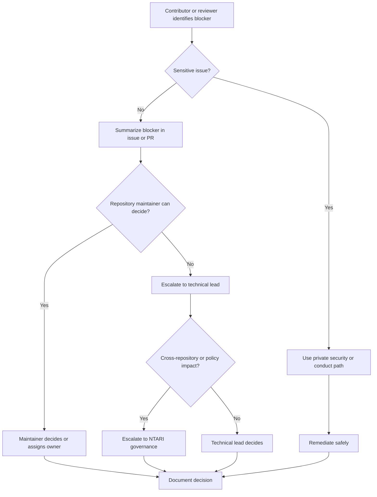

# Engineering Escalation

## Overview

Engineering escalation is the process COSDS contributors use when normal issue,
pull request, or review discussion cannot resolve a risk, decision, or blocker.
Escalation is not a failure. It is a governance tool that protects contributor
time, repository quality, security, licensing, and NTARI's open-source mission.

Escalation should be visible when the topic is safe for public discussion and
private when the topic involves security, privacy, conduct, or sensitive
operational details.

## Escalation Principles

| Principle | Practice |
| --- | --- |
| Escalate early | Raise blockers before work stalls or contributors duplicate effort. |
| Use the right channel | Public issues for routine blockers; private paths for sensitive concerns. |
| Preserve context | Link issues, pull requests, logs, decisions, and attempted resolutions. |
| Seek accountable decisions | Identify who can decide, not only who can discuss. |
| Document outcomes | Summarize decisions where future contributors can find them. |

## When to Escalate

Escalate when:

- A pull request is blocked by unresolved technical disagreement.
- A change may introduce security, privacy, licensing, or compliance risk.
- Review comments conflict and the author needs a decision.
- An issue is blocked by missing scope, ownership, or acceptance criteria.
- A workflow, release, or repository setting affects contributor safety.
- Conduct concerns affect collaboration.
- A decision has impact beyond one repository.

Do not escalate routine questions before attempting normal clarification through
[Communication Standards](04-communication-standards.md).

## Escalation Levels

| Level | Use for | Decision owner |
| --- | --- | --- |
| Contributor clarification | Missing context or simple scope question. | Issue owner or reviewer |
| Maintainer decision | Repository workflow, merge, label, or ownership decision. | Repository maintainer |
| Technical lead decision | Architecture, implementation, or risk tradeoff. | Technical lead |
| Security escalation | Sensitive vulnerability, secret, or abuse concern. | Security contact or maintainer |
| Governance escalation | Cross-repository policy, licensing, or conduct matter. | NTARI governance owner |

## Standard Escalation Flow



## Escalation Request Format

Use this format in an issue or pull request when public discussion is safe:

```markdown
## Escalation Request

### Decision needed
What specific decision is required?

### Context
Link issues, pull requests, commits, logs, or prior discussion.

### Options considered
1. Option A: benefits and risks.
2. Option B: benefits and risks.

### Recommendation
State the preferred option and why.

### Deadline or impact
Explain whether work is blocked and by when a decision is needed.
```

## Sensitive Escalations

Use private reporting paths for:

- Suspected vulnerabilities.
- Secret exposure.
- Personal data exposure.
- Harassment, threats, or retaliation.
- Private infrastructure details.
- Unapproved disclosure of sensitive operational information.

Follow [`../../SECURITY.md`](../../SECURITY.md) for security and repository
integrity issues. Follow [`../../CODE_OF_CONDUCT.md`](../../CODE_OF_CONDUCT.md)
for conduct concerns.

## Decision Documentation

After an escalation is resolved, document:

- The decision.
- The decision owner.
- The reason for the decision.
- Follow-up issues or pull requests.
- Any constraints or expiration date.

Do not publish sensitive details. When the full decision cannot be public,
record a public-safe summary such as:

```markdown
Decision: maintainers accepted the remediation approach discussed through the
private security process. Public documentation will be updated after the fix is
released.
```

## Escalation Checklist

Before escalating, confirm:

- The blocker is clearly stated.
- Existing handbook guidance has been checked.
- Relevant issue or pull request links are included.
- The requested decision is specific.
- Sensitive information is not posted publicly.
- The right owner or role is requested.

## Related Chapters

- [Engineering Roles](03-engineering-roles.md)
- [Communication Standards](04-communication-standards.md)
- [Security Standards](13-security-standards.md)
- [Professional Conduct](17-professional-conduct.md)
- [GitHub Governance](26-github-governance.md)
