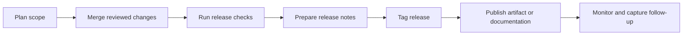

# Release Management

## Overview

Release management is the governance process for deciding when a change becomes
available to users, contributors, or downstream operators. In COSDS, releases
must be traceable, reviewable, license-aware, and reversible when practical.

A release may be a software package, documentation publication, container image,
configuration bundle, or tagged repository state.

## Release Principles

| Principle | Practice |
| --- | --- |
| Release from reviewed work | Only release changes merged through the approved workflow. |
| Keep provenance clear | Use tags, release notes, and linked pull requests. |
| Prefer repeatability | Document commands and automate safely. |
| Protect users | Include validation, rollback notes, and known limitations. |
| Respect AGPL-3.0 | Preserve source availability, license notices, and attribution. |
| Separate release from deployment | Publishing an artifact is not always the same as deploying it. |

## Release Types

| Type | Use for | Example |
| --- | --- | --- |
| Documentation release | Publishing updated docs or handbook content. | Developer Portal publication |
| Patch release | Backward-compatible fix. | Security or bug fix |
| Minor release | Backward-compatible feature or improvement. | New CLI command |
| Major release | Breaking change or migration requirement. | Schema change |
| Emergency release | Time-sensitive remediation. | Secret exposure fix |

## Release Lifecycle



## Release Readiness Criteria

A release is ready when:

- Included changes are merged into the release branch or default branch.
- Required checks pass or exceptions are documented.
- Release notes summarize user-visible changes.
- Breaking changes and migration steps are documented.
- License and attribution obligations are satisfied.
- Security-sensitive timing has been coordinated.
- Rollback or remediation steps are understood.

## Versioning Guidance

Repositories should define their versioning approach before the first public
release. Semantic Versioning is appropriate for many software projects, but
some documentation repositories may use date-based releases or named milestones.

| Versioning model | Best for | Example |
| --- | --- | --- |
| Semantic Versioning | Libraries, APIs, CLIs, services with compatibility promises. | `v1.4.2` |
| Calendar Versioning | Documentation snapshots or scheduled releases. | `2026.08` |
| Milestone labels | Early-stage repositories without stable release promises. | `cosds-alpha` |

## Release Notes

Release notes should include:

- Summary of the release.
- Notable changes.
- Breaking changes or migrations.
- Security notes that are safe to publish.
- Contributors or acknowledgements when appropriate.
- Links to related issues, pull requests, and tags.

Example:

```markdown
## v1.2.0

### Added

- Added Engineering RFC issue form.

### Changed

- Updated pull request checklist for documentation validation.

### Security

- No security-sensitive changes in this release.
```

## Emergency Releases

Emergency releases are allowed when delaying would create unacceptable risk.
They still require traceability.

Minimum emergency release steps:

1. Notify maintainers and security contacts.
2. Create the smallest safe remediation.
3. Obtain appropriate review for the risk level.
4. Release from a known commit.
5. Document public-safe notes.
6. Create follow-up issues for cleanup and retrospective review.

## Documentation Publication

When documentation is published through a future site generator such as
Docusaurus, the publication process should:

- Build from reviewed Markdown.
- Run link and spelling checks before publication.
- Preserve source repository links.
- Avoid publishing drafts or sensitive notes.
- Record the published revision.

Do not add publication tooling until NTARI approves the publishing architecture.

## Release Checklist

Before release:

- Confirm scope and release owner.
- Confirm required pull requests are merged.
- Run required checks.
- Review license and attribution impact.
- Draft release notes.
- Confirm rollback or remediation path.
- Tag or identify the release commit.

After release:

- Verify publication or artifact availability.
- Update related issues and milestones.
- Monitor reports.
- Create follow-up issues.
- Record lessons learned when needed.

## Related Chapters

- [CI/CD Standards](12-ci-cd-standards.md)
- [Security Standards](13-security-standards.md)
- [Pull Request Process](08-pull-request-process.md)
- [Repository Standards](10-repository-standards.md)
- [Continuous Improvement](21-continuous-improvement.md)
