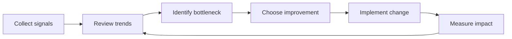

# Engineering Metrics

## Overview

Engineering metrics help NTARI understand whether COSDS work is healthy,
reviewable, inclusive, and sustainable. Metrics should guide improvement, not
punish contributors. Volunteer communities require careful interpretation
because availability varies.

Metrics must be used with context. A number without context can mislead.

## Metrics Principles

| Principle | Practice |
| --- | --- |
| Measure systems, not worth | Use metrics to improve process, not judge individual value. |
| Prefer trends | Compare changes over time instead of reacting to one data point. |
| Include qualitative context | Pair numbers with contributor feedback and retrospectives. |
| Protect privacy | Do not publish sensitive personal or operational data. |
| Keep metrics actionable | Track measures that can lead to process improvements. |

## Core KPIs

| KPI | What it measures | Why it matters |
| --- | --- | --- |
| Issue triage time | Time from issue creation to first maintainer response. | Shows whether contributors receive timely direction. |
| Pull request review time | Time from review request to first substantive review. | Helps maintain volunteer momentum. |
| Pull request cycle time | Time from PR open to merge or close. | Indicates review and delivery flow. |
| Change failure rate | Share of merged changes that require rollback or urgent fix. | Highlights quality and risk management. |
| CI pass rate | Share of PRs with passing required checks. | Shows automation reliability and contributor readiness. |
| Documentation freshness | Pages reviewed or updated within an agreed period. | Reduces stale guidance. |
| Contributor activation | New contributors who complete a first accepted contribution. | Measures onboarding effectiveness. |
| Escalation resolution time | Time from escalation request to documented decision. | Shows governance responsiveness. |

## Supporting Metrics

Additional metrics may include:

- Number of open issues by label.
- Number of blocked issues.
- Ratio of draft to ready pull requests.
- Frequency of stale issue cleanup.
- Number of broken links detected.
- Number of documentation pages with owners.
- Percentage of repositories with required community health files.

## Metrics Flow

## Interpretation Guidance

Metrics should be reviewed with context.

Example interpretations:

| Observation | Possible meaning | Follow-up question |
| --- | --- | --- |
| PR review time increases | Maintainers are overloaded or PRs are too large. | Are reviews waiting on owners or scope clarity? |
| CI pass rate decreases | Checks are flaky or contributors lack setup guidance. | Are failures actionable and documented? |
| Issue count increases | Community engagement is growing or triage is delayed. | How many issues are actionable? |
| Contributor activation drops | Onboarding is unclear or first issues are too hard. | Do volunteers have good first issues? |

## Anti-Patterns

Avoid:

- Ranking volunteers by number of commits.
- Treating review speed as more important than review quality.
- Ignoring security or accessibility because they are harder to quantify.
- Using metrics without explaining limitations.
- Publishing personal performance data without consent and governance approval.

## Data Sources

Potential sources include:

- GitHub issues and pull requests.
- GitHub Actions results.
- Release notes.
- Repository readiness reviews.
- Contributor surveys.
- Retrospective notes.

Data collection should respect privacy and platform terms.

## KPI Review Checklist

When reviewing metrics, ask:

- What decision will this metric inform?
- Is the data complete enough to trust?
- What context explains the trend?
- Could this metric create harmful incentives?
- What improvement will we try next?
- How will we know whether the improvement worked?

## Reporting Cadence

Recommended cadence:

| Cadence | Review focus |
| --- | --- |
| Weekly during sprint | Blockers, review queues, CI failures, urgent issues. |
| Monthly | Trends, contributor onboarding, documentation freshness. |
| Per release | Quality, release readiness, follow-up work. |
| Quarterly | Governance, tooling, repository standards, strategic improvements. |

## Related Chapters

- [Issue Management](14-issue-management.md)
- [Pull Request Process](08-pull-request-process.md)
- [Code Review Standards](09-code-review-standards.md)
- [Continuous Improvement](21-continuous-improvement.md)
- [Volunteer Expectations](16-volunteer-expectations.md)
