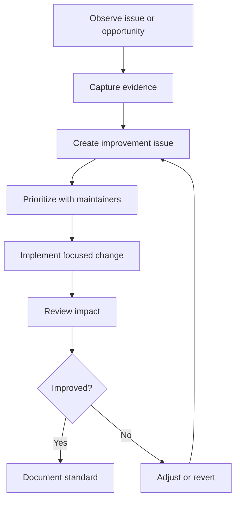

# Continuous Improvement

## Overview

Continuous improvement is the COSDS practice of learning from work and making
the next sprint safer, clearer, and more effective. It turns review comments,
metrics, incidents, contributor feedback, and release outcomes into actionable
changes.

Improvement work should be visible, prioritized, and reviewed like any other
engineering work.

## Improvement Principles

| Principle | Practice |
| --- | --- |
| Improve the system | Fix process gaps, not only individual symptoms. |
| Keep changes small | Test process improvements in manageable increments. |
| Use evidence | Combine metrics, examples, and contributor feedback. |
| Document decisions | Capture what changed and why. |
| Close the loop | Verify whether the improvement helped. |

## Improvement Sources

Continuous improvement inputs include:

- Retrospectives.
- Pull request review patterns.
- CI failures.
- Security findings.
- Release follow-up issues.
- Contributor onboarding feedback.
- Documentation gaps.
- Engineering metrics.

See [Engineering Metrics](20-engineering-metrics.md) for KPI guidance.

## Improvement Process



## Retrospectives

Retrospectives should be lightweight and blameless. The goal is to improve the
system of work.

Recommended prompts:

- What helped contributors make progress?
- What blocked or slowed work?
- What confused new contributors?
- Which review comments repeated across pull requests?
- Which checks failed most often?
- What should we start, stop, or continue?

## Improvement Issue Template

Use this structure when proposing process improvement:

```markdown
## Improvement Opportunity

Describe the process gap or recurring problem.

## Evidence

Link examples, metrics, issues, pull requests, or feedback.

## Proposed Change

Describe the smallest useful improvement.

## Expected Outcome

Explain how contributors or maintainers will benefit.

## Validation

Describe how we will know whether the change helped.
```

## Prioritization

Prioritize improvements that:

- Reduce security or licensing risk.
- Unblock multiple contributors.
- Reduce repeated maintainer work.
- Improve onboarding.
- Make CI failures more actionable.
- Prevent release or operational mistakes.

Defer improvements that are speculative, too broad, or not tied to observed
friction.

## Change Management

Process changes should be introduced carefully.

Checklist:

- Identify affected contributors.
- Update relevant handbook chapters.
- Update templates or workflows when needed.
- Announce the change in the relevant issue or pull request.
- Provide examples.
- Review impact after a defined period.

## Learning from Incidents

An incident may involve security, release failure, workflow breakage, or
community harm. Incident learning should be blameless and action-oriented.

Public-safe incident follow-up should include:

- What happened.
- What impact occurred.
- What was fixed.
- What process improvement will prevent recurrence.
- What details cannot be public and why.

Sensitive details must follow [`../../SECURITY.md`](../../SECURITY.md) and
[`../../CODE_OF_CONDUCT.md`](../../CODE_OF_CONDUCT.md) as applicable.

## Improvement Backlog Checklist

Maintainers should periodically review whether:

- Improvement issues have clear owners.
- High-risk process gaps are prioritized.
- Completed improvements were documented.
- Repeated review comments have become guidance.
- Metrics show whether changes helped.
- Stale improvement proposals should be closed or reframed.

## Related Chapters

- [Engineering Metrics](20-engineering-metrics.md)
- [Issue Management](14-issue-management.md)
- [Release Management](19-release-management.md)
- [Documentation Standards](11-documentation-standards.md)
- [Engineering Escalation](18-engineering-escalation.md)
