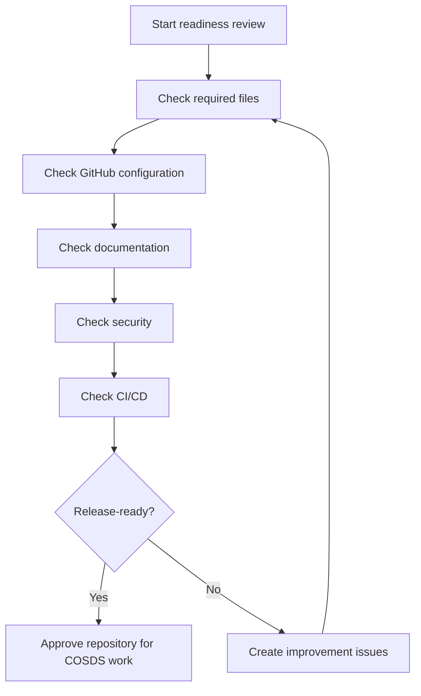

# Repository Checklist

## Overview

The repository checklist helps maintainers evaluate whether an NTARI repository
is ready for COSDS participation. It covers governance, GitHub compatibility,
security, documentation, automation, accessibility, licensing, and release
readiness.

Use this checklist during repository creation, readiness reviews, and periodic
maintenance.

## Compliance Summary

| Area | Required outcome |
| --- | --- |
| Governance | Maintainers, ownership, and contribution rules are visible. |
| Licensing | License and third-party obligations are clear. |
| Security | Sensitive reporting and secret handling are defined. |
| GitHub workflow | Issues, pull requests, reviews, and branch protections are usable. |
| Documentation | README and contributor guidance are accurate. |
| Automation | CI checks match repository risk and are actionable. |
| Accessibility | Public documentation is readable and inclusive. |
| Cleanliness | Generated, local, and sensitive files are not tracked. |

## Required Files Checklist

- [ ] `README.md` explains repository purpose and current status.
- [ ] `LICENSE` is present and appropriate for the repository.
- [ ] `CONTRIBUTING.md` explains how to contribute.
- [ ] `CODE_OF_CONDUCT.md` defines community standards.
- [ ] `SECURITY.md` explains sensitive reporting expectations.
- [ ] `CODEOWNERS` routes review responsibility.
- [ ] `.gitignore` excludes local, generated, and sensitive files.
- [ ] `.editorconfig` defines basic formatting rules.

See [Repository Standards](10-repository-standards.md).

## GitHub Configuration Checklist

- [ ] Pull request template is present.
- [ ] Issue templates support bugs, documentation, feature requests, and RFCs.
- [ ] Labels match issue templates and triage needs.
- [ ] Default branch is protected when appropriate.
- [ ] Required reviews are configured for protected branches.
- [ ] Required status checks are stable before enforcement.
- [ ] CODEOWNERS teams exist and have repository access.
- [ ] Workflow permissions use least privilege.

## Documentation Checklist

- [ ] README uses clear, accessible language.
- [ ] Internal links resolve.
- [ ] Public documentation avoids private links.
- [ ] Examples are safe to copy.
- [ ] Images or diagrams include text explanations.
- [ ] Project-specific docs link to handbook standards instead of duplicating
  shared policy.
- [ ] Placeholder text is not present in production pages.

See [Documentation Standards](11-documentation-standards.md).

## Security Checklist

- [ ] No secrets, credentials, or private keys are committed.
- [ ] `.env` files are ignored unless they are safe examples.
- [ ] Security reporting path is documented.
- [ ] Dependency additions are reviewed for license and security impact.
- [ ] Workflows do not expose secrets to untrusted code.
- [ ] Logs and examples avoid sensitive values.
- [ ] Security-sensitive procedures are not overexposed publicly.

See [Security Standards](13-security-standards.md).

## CI/CD Checklist

- [ ] Markdown linting runs for documentation changes when appropriate.
- [ ] Link checking runs for Markdown changes or on a schedule.
- [ ] Spellcheck is available for contributor-facing documentation.
- [ ] Tests run for code changes.
- [ ] Workflow failures are actionable.
- [ ] Third-party actions are approved by maintainers.
- [ ] Release and deployment workflows are separate from validation workflows.

See [CI/CD Standards](12-ci-cd-standards.md).

## Release Readiness Checklist

- [ ] Release owner is identified.
- [ ] Release scope is documented.
- [ ] Required changes are merged.
- [ ] Release notes are drafted.
- [ ] License and attribution requirements are reviewed.
- [ ] Rollback or remediation plan is known.
- [ ] Published artifact or documentation can be verified.

See [Release Management](19-release-management.md).

## Repository Readiness Flow

## Review Cadence

| Cadence | Focus |
| --- | --- |
| New repository | Required files, license, security, contribution path. |
| Before sprint | Issues, labels, onboarding, CI health. |
| Before release | Release notes, checks, license, rollback. |
| Quarterly | Ownership, workflow health, documentation freshness. |

## Related Chapters

- [Repository Standards](10-repository-standards.md)
- [Documentation Standards](11-documentation-standards.md)
- [Security Standards](13-security-standards.md)
- [CI/CD Standards](12-ci-cd-standards.md)
- [Release Management](19-release-management.md)
