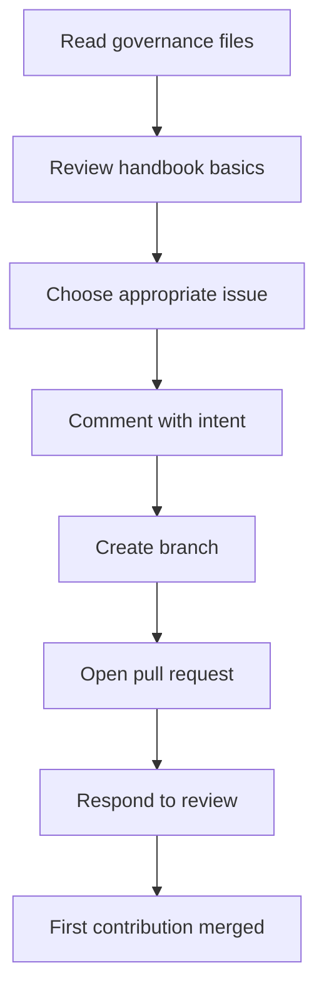

# Volunteer Onboarding Checklist

## Overview

The volunteer onboarding checklist helps new COSDS participants move from
interest to a safe, reviewable first contribution. It also helps maintainers and
project coordinators provide consistent support without relying on private
context.

Use this checklist for self-service onboarding, sprint preparation, and mentor
support.

## Onboarding Goals

A new volunteer should be able to:

- Understand NTARI's contribution expectations.
- Choose appropriate work.
- Communicate status and blockers.
- Open a focused pull request.
- Respond to review professionally.
- Avoid common security, licensing, and documentation mistakes.

## Volunteer Readiness Checklist

Before starting work:

- [ ] Read the repository `README.md`.
- [ ] Read [`../../CONTRIBUTING.md`](../../CONTRIBUTING.md).
- [ ] Read [`../../CODE_OF_CONDUCT.md`](../../CODE_OF_CONDUCT.md).
- [ ] Review [Purpose](01-purpose.md).
- [ ] Review [Engineering Principles](02-engineering-principles.md).
- [ ] Review [Volunteer Expectations](16-volunteer-expectations.md).
- [ ] Confirm you can use GitHub issues and pull requests.
- [ ] Confirm you understand how to report sensitive issues through
  [`../../SECURITY.md`](../../SECURITY.md).

## First Issue Checklist

Before claiming an issue:

- [ ] The issue is still open.
- [ ] The issue has enough detail to begin.
- [ ] The work is suitable for your experience and availability.
- [ ] The issue is not security-sensitive unless a maintainer directed you to it.
- [ ] You have asked clarifying questions if scope is unclear.
- [ ] You have commented with your intent to work on it.

Good claim comment:

```markdown
I would like to work on this. I plan to update the documentation example and
verify the related links. I will open a draft pull request if I need early
feedback.
```

## Local Setup Checklist

Before editing:

- [ ] Fork or clone the repository as directed.
- [ ] Create a branch from the default branch.
- [ ] Read any project-specific setup instructions.
- [ ] Avoid adding real secrets or private configuration.
- [ ] Confirm local tools are available if the project requires them.

Branch example:

```bash
git checkout main
git pull --ff-only
git checkout -b docs/clarify-validation-example
```

See [Branching Strategy](06-branching-strategy.md).

## Pull Request Checklist

Before requesting review:

- [ ] The pull request has a clear title.
- [ ] The description explains what changed and why.
- [ ] The related issue is linked.
- [ ] Validation steps are listed.
- [ ] The change is focused.
- [ ] Internal links are valid if Markdown changed.
- [ ] No placeholder text remains in production documentation.
- [ ] No secrets or private information are included.
- [ ] Licensing or attribution questions are raised in the PR.

See [Pull Request Process](08-pull-request-process.md).

## Review Response Checklist

During review:

- [ ] Read all comments before responding.
- [ ] Ask for clarification when needed.
- [ ] Address blocking comments before requesting another review.
- [ ] Explain any alternative approach respectfully.
- [ ] Keep new work scoped to the pull request goal.
- [ ] Create follow-up issues for separate work.

See [Code Review Standards](09-code-review-standards.md).

## Onboarding Flow



## Maintainer Support Checklist

Maintainers and coordinators should provide:

- [ ] Clear first issues.
- [ ] Prompt acknowledgment of volunteer intent.
- [ ] Scope clarification when needed.
- [ ] Respectful review feedback.
- [ ] Guidance on validation commands.
- [ ] Follow-up issues when work expands.
- [ ] Recognition of accepted contributions.

## Common Onboarding Pitfalls

| Pitfall | Prevention |
| --- | --- |
| Starting without issue context | Ask contributors to comment before beginning. |
| Pull request is too large | Encourage smaller scoped changes. |
| Contributor lacks validation steps | Provide examples in the PR template. |
| Review feels personal | Use conduct and review standards. |
| Security detail is posted publicly | Redirect to private reporting path. |

## Related Chapters

- [Volunteer Expectations](16-volunteer-expectations.md)
- [Professional Conduct](17-professional-conduct.md)
- [GitHub Workflow](05-github-workflow.md)
- [Issue Management](14-issue-management.md)
- [Pull Request Process](08-pull-request-process.md)
