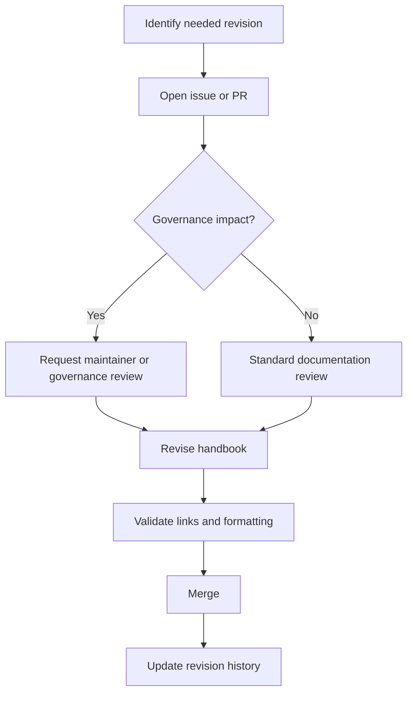

# Revision History

## Overview

Revision history records how the COSDS Engineering Handbook changes over time.
It helps contributors understand when standards changed, why they changed, and
where to find the related pull requests or decisions.

This chapter defines the governance process for handbook revisions. The detailed
history table should be updated as handbook content changes.

## Revision Governance

Handbook revisions must be:

- Proposed through issues, pull requests, or RFCs when appropriate.
- Reviewed by maintainers or owners for the affected topic.
- Linked to related decisions, metrics, incidents, or retrospectives.
- Written in production-ready Markdown.
- Compatible with AGPL-3.0 governance and open-source contribution practices.

## When to Update the Handbook

Update the handbook when:

- A workflow changes.
- Governance expectations change.
- Repeated review comments reveal missing guidance.
- A release or incident creates a new standard.
- A repository checklist requirement changes.
- Volunteer onboarding feedback identifies confusion.
- A Docusaurus publication decision changes authoring requirements.

## Revision Types

| Type | Description | Review expectation |
| --- | --- | --- |
| Editorial | Clarifies wording without changing expectations. | Standard documentation review. |
| Process | Changes how contributors or maintainers work. | Maintainer review required. |
| Governance | Changes ownership, escalation, security, or licensing expectations. | Governance owner review required. |
| Security | Changes security guidance or disclosure handling. | Security-aware review required. |
| Publication | Changes future site generation or navigation assumptions. | Documentation owner review required. |

## Revision Workflow



## Revision Entry Format

Use this format for substantial handbook changes:

```markdown
| Date | Version or PR | Change | Reason | Owner |
| --- | --- | --- | --- | --- |
| 2026-08-05 | PR #123 | Added release management chapter. | Defined COSDS release governance. | NTARI maintainers |
```

If the repository does not yet use versioned handbook releases, reference the
pull request or commit that introduced the change.

## Current Revision Log

| Date | Version or reference | Change | Reason | Owner |
| --- | --- | --- | --- | --- |
| 2026-08-05 | Initial COSDS handbook authoring | Authored governance and onboarding chapters. | Establish production-ready COSDS engineering governance. | NTARI maintainers |

## Change Review Checklist

Before merging handbook revisions, confirm:

- The change has a clear reason.
- Related chapters are updated or linked.
- Internal links resolve.
- No outdated placeholder text remains in edited production chapters.
- Governance, security, or licensing changes have appropriate review.
- Examples and checklists still match current practice.
- The revision history is updated for substantive changes.

## Versioning the Handbook

NTARI may later choose to version the handbook. Versioning is useful when:

- External contributors rely on stable published guidance.
- Docusaurus publication creates public documentation snapshots.
- Governance or compliance reviews require traceable policy versions.
- Major process changes need migration notes.

Until a versioning model is approved, pull request and commit references are the
source of truth for handbook history.

## Archiving Superseded Guidance

Do not leave contradictory guidance in active handbook pages. When guidance is
superseded:

1. Update the active page.
2. Link to the new standard where useful.
3. Capture the reason in the revision log or pull request.
4. Archive historical context only if it remains valuable.

## Revision Ownership

| Area | Recommended reviewer |
| --- | --- |
| GitHub workflow and pull requests | Repository maintainers |
| Security standards | Security contact or maintainer |
| Release management | Maintainer and technical lead |
| Volunteer onboarding | Project coordinator or maintainer |
| Professional conduct | Governance owner or maintainer |
| Documentation standards | Documentation maintainer |

## Related Chapters

- [Continuous Improvement](21-continuous-improvement.md)
- [Repository Checklist](22-repository-checklist.md)
- [Volunteer Onboarding Checklist](23-volunteer-onboarding-checklist.md)
- [Engineering Escalation](18-engineering-escalation.md)
- [Release Management](19-release-management.md)
